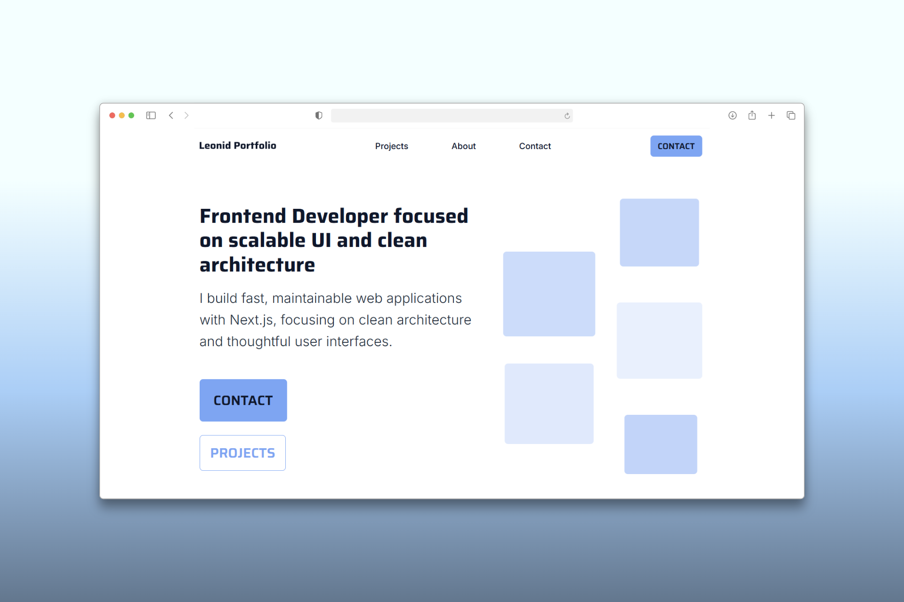

# 🚀 Modern Portfolio | Next.js & Headless WordPress

> A high-performance, accessible portfolio designed to showcase engineering skills and architectural best practices.

---

## 📸 Preview

  

_Live Demo:_ [leonid-dev.com](https://leonid-dev.com/)

## 🎯 Project Purpose

This repository serves as a showcase for my skills in **Frontend Engineering** and **System Architecture**. It focuses on delivering a seamless user experience while maintaining a clean, scalable codebase.

## 🛠 Tech Stack

| Layer          | Technology                                               |
| -------------- | -------------------------------------------------------- |
| **Frontend**   | [Next.js](https://nextjs.org/) (App Router), CSS Modules |
| **Backend**    | Headless WordPress via REST API                          |
| **Design**     | Figma                                                    |
| **Deployment** | Vercel                                                   |

_Developed with a focus on performance, accessibility, and user experience._
